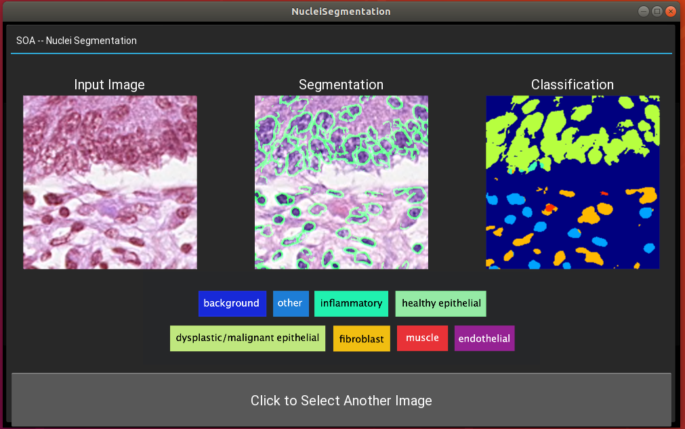

# Class-wise Nuclei Segmentation 
#### *This is code for SUTD 50.021 Artificial Intelligence final project*

### Team members:
Zhao Lutong 1002872,
Wang Zijia 1002885,
Tang Xiaoyue 1002968,
Lin Xiaohao 1003144

## Instructions to run our code
### Prepare Environment
Install the Kivy packages in requirements.txt, using 
<br>
```
$ pip install -r requirements.txt
```

### Run Through GUI
Under UNet-pytorch/GUI run 
<br>
```
$ python3 gui.py
```

(If you are running on GPU, please make sure is_cuda = False under utils.py)
<br> Preview of our GUI



### Directly Testing/Training

#### Testing/Inference Mode:s
1. Make sure the trained model (e.g. “model-150-color.pt” ) is under root/checkpoints
2. Make sure is_train = False in utils.py
3. Under root, run python3 train.py
<br>
```
$ python3 train.py
```

#### Training Mode:
Before Training, we need to firstly prepare our data:
1. Please put the CoNSeP dataset under structure of  Root/data/concept/CoNSeP/Train(Test)
2. Under root, run python3 procee_data.py 

3. Then we will need to pass training parameter under utils.py:
4. Under class Option, please set is_train = True and is _cuda = True if you are using GPU for training.
5. Under root, run 
<br>
```
$ python3 train.py
```
<br>

*For detailed results and instructions, please read our report :)*

#### References
1. https://warwick.ac.uk/fac/sci/dcs/research/tia/data/hovernet
2. https://github.com/limingwu8/UNet-pytorch